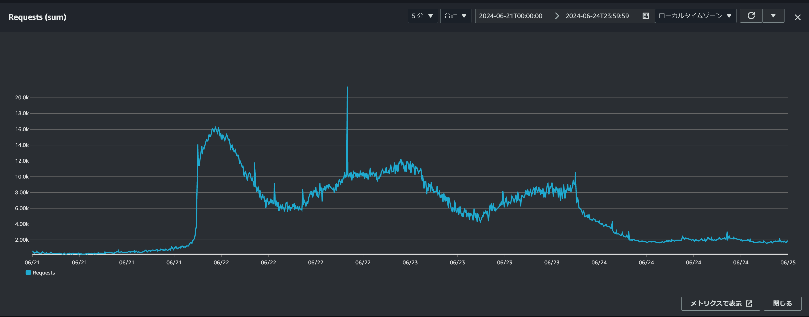
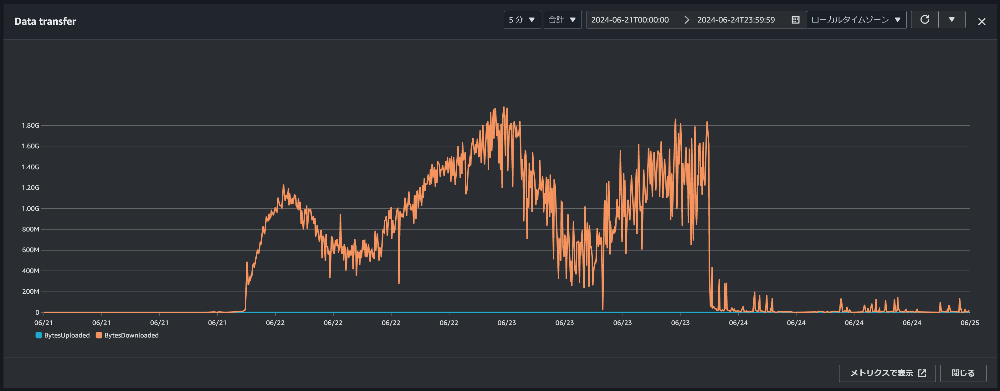
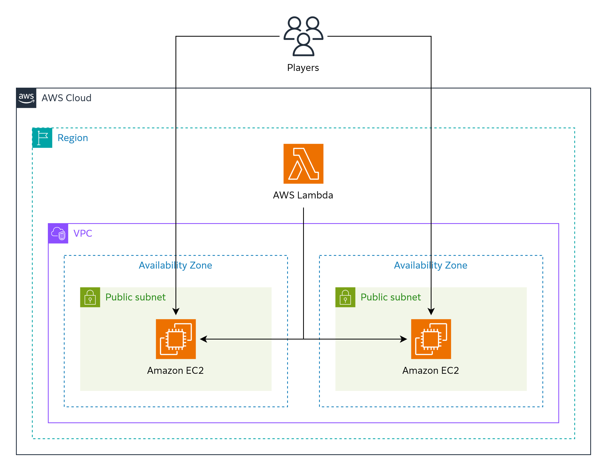

# WaniCTF 2024開催記

私の所属している大阪大学CTFサークルWani Hackaseは、6月にCTF大会「WaniCTF 2024」を開催しました。この記事ではWaniCTF 2024を支えたインフラを紹介しながら大会を振り返ります。

https://wanictf.org/

## 大会概要

|||
|---|---|
|大会名|WaniCTF 2024|
|運営|大阪大学CTFサークル Wani Hackase|
|開催期間|2024/06/21（金）21:00 ～ 2024/06/23（日）21:00 JST（48時間）|
|形式|Jeopardy形式によるオンラインでのチーム戦|
|参加チーム数|登録：約1,600チーム、うち1問以上提出：1,022チーム|

WaniCTFはWani Hackaseが2020年から開催しているCTFです。これが5回目の開催となります。

本大会はすべての問題を英語と日本語の両方で提供し、オンラインで全世界から参加者を募りました。体感では参加者の半分以上が非日本語話者でした。

## スコアサーバー

### リクエストの流れ

CTFにおけるスコアサーバーは、参加者による参加登録やフラグの提出を受け付け、順位表を提供するWebサーバーです。

WaniCTFのスコアサーバーはSPAとして作られています。ユーザーからのリクエストは下図の流れに沿って処理されます。

![AWS上で構築されたWebサービスのアーキテクチャ。ユーザーからのアクセスは、Amazon Route 53とAmazon CloudFrontを経由して単一リージョン内のAmazon S3やApplication Load Balancerに到達する。リージョンには1つのVPCが存在する。VPC内には2つのアベイラビリティゾーンがあり、各ゾーンにパブリックサブネットとプライベートサブネットがある。パブリックサブネットにはApplication Load BalancerとNATゲートウェイが配置されている。プライベートサブネットにはAmazon ECSタスク、Amazon RDS (MySQL)、Amazon ElastiCache (Redis)が配置されている。Application Load BalancerはECSタスクにトラフィックを分散する。Amazon ECSタスクはAmazon ECSクラスタ内で動作しており、AWS Fargateを利用している。片方のアベイラビリティゾーンに配置されたAmazon RDSとAmazon ElastiCacheはPrimaryで、もう片方はSecondaryである。Amazon ECSタスクはPrimaryのAmazon RDSとAmazon ElastiCacheにアクセスする。](./wanictf2024/architecture-score-traffic.webp)

静的ファイルはAmazon S3にホストされており、APIリクエストはALBを経由してAmazon ECS上のAPIサーバーに送られます。

各コンポーネントはAZ障害に耐えられるように冗長化しています。NATゲートウェイ、ALB、ECSタスクは2つのAZに分散して配置し、RDSとElastiCacheはマルチAZ構成を採用しています。ただし、ALBは本来3つのAZに配置しないとAZ障害時に正しく動作しないようです。大会終了後に気づきました。

また、サーバーは大会の前後1週間も稼働していましたが、大会本番以外の期間はコスト削減のため冗長性を落としました。具体的には、NATゲートウェイの代わりにNATインスタンスを利用し、ECSのタスク数を削減し、RDSとElastiCacheのマルチAZ設定を解除しました。

### 運用とデプロイ

APIサーバーのアプリケーションのデプロイと運用の流れは以下の通りです。


アプリケーションのデプロイ時にはGitHub ActionsからAWSの各サービスにアクセスします。この際GitHubのOIDCプロバイダを利用し、安全にIAMロールをAssumeRoleできるようにしています。

メトリクスとログはGrafana Cloudに集約しています。Grafana Cloudの無料プランには保存期間やアクティブユーザー数の制限がありますが、インフラは私一人で管理しており、大会が実際に開催されるのは2日間だけだったため問題なく利用できました。

### 実際のトラフィック

大会期間中に記録したメトリクスをいくつか紹介します。

#### リクエスト数



こちらのグラフはCloudFrontに対するリクエスト数を示しています。縦軸は5分間のリクエスト数です。一瞬のスパイクを除いたピーク時のリクエスト数は3000 req/min程度でした。

48時間の開催期間とその前後を含む96時間の合計リクエスト数は607万でした。このうち95%がAPIリクエストで、残りの5%が静的ファイルの要求です。現在使用している問題サーバーでは、順位表等のリアルタイム更新のため特定のAPIをブラウザから定期的に呼び出しています。ユーザー数に対してAPIリクエスト数が多いのはこのためです。

### 転送量



こちらのグラフはCloudFrontの転送量を示しています。青の線が上り、オレンジの線が下りで、縦軸は5分間の転送量（bytes）です。上りの転送量は下りと比較するとほぼ0です。ピーク時の下り転送量は3Gbps程度でした。

48時間の開催期間とその前後を含む96時間の合計転送量は上り29MB、下り614GBでした。このうち96%がAPIリクエストによるもので、残りの4%が静的ファイルの配信です。

## 問題サーバー

CTFにおける問題サーバーは、参加者による攻撃の対象となるサーバーです。本大会の問題サーバーは以下の図に示すような単純な構成です。



問題の性質上ロードバランサは使用せず、参加者がEC2インスタンスに直接アクセスする構成としています。それぞれのIPアドレスを参加者に通知しており、参加者はいずれか1つのインスタンスを選んでアクセスします。

また、AWS Lambdaから各問題のヘルスチェックを行っています。ヘルスチェック結果はスコアサーバーやDiscordに送信しており、参加者や運営が不具合発生を把握できるようになっています。

## 踏み台サーバー

運営がVPC内のサーバーにアクセスするための踏み台サーバーも用意しました。Fargate上でTailscaleのクライアントを起動し、[subnet router](https://tailscale.com/kb/1019/subnets)として動作させています。

## AWSリソースの管理

大会で使用したAWSリソースはすべてTerraformで管理しました。例えば、先述した踏み台サーバーのECSタスク定義は以下のようになります。

```terraform
resource "aws_ecs_task_definition" "bastion" {
  family = "bastion"

  cpu    = 256
  memory = 512

  execution_role_arn       = aws_iam_role.bastion_ecs_task_execution.arn
  network_mode             = "awsvpc"
  requires_compatibilities = ["FARGATE"]
  task_role_arn            = aws_iam_role.bastion_ecs_task.arn

  container_definitions = jsonencode([
    {
      name  = "tailscale"
      image = "ghcr.io/tailscale/tailscale:v1.66.3"
      environment = [
        { name = "TS_ROUTES", value = aws_vpc.main.cidr_block },
      ]
      secrets = [
        { name = "TS_AUTHKEY", valueFrom = var.tailscale_authkey_param_arn },
      ]
      linuxParameters = {
        initProcessEnabled = true
      }
    },
  ])
}
```

## 来年に向けて

本大会は多くのCTFプレイヤーに参加いただき、大きなトラブルもなく無事終了することができました。これからも末永くWaniCTFを開催できるよう、作問と新入生の育成に力を入れていきます。

大阪大学CTFサークルWani Hackaseでは、1年を通して新メンバーを募集しています。主な活動は以下の通りです。

- 週1回：30分程度のオンラインミーティング
  - サイバーセキュリティに関する話題の共有
  - 参加したCTFの報告
  - 自作問題の出題（持ち回りで毎週一人が作問、初心者は免除）
  - 週末のCTFの予定確認
- 週1回：CTFへの参加（任意）
  - オンラインで開催されるCTFにチームで参加
  - 年数回はキャンパスやレンタルスペースに集まって参加することも
- 年1回：WaniCTFの運営
  - 問題作成
  - インフラ構築
  - 大会当日の進行
- 年1回：オフラインでの合宿
  - 2024年は白浜で一泊二日の勉強会を開催

大阪大学の学生か教職員で興味のある方は、お気軽に私のTwitterアカウント ([@ciffelia](https://x.com/ciffelia))やチームの連絡先までご連絡ください。

https://wanictf.org/about/
